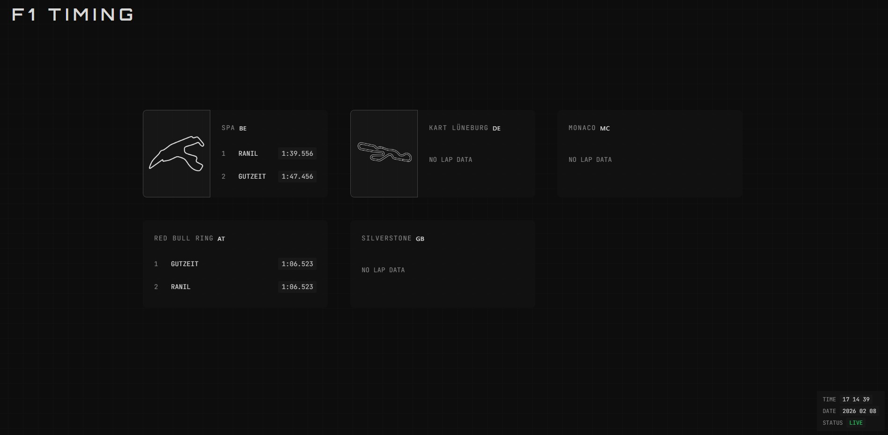
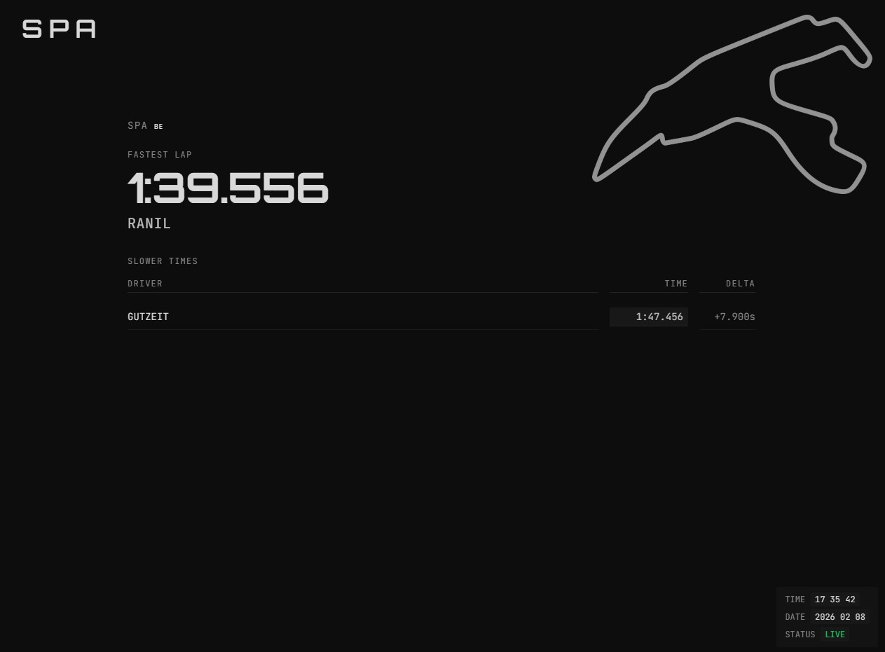

<p align="center">
  <strong>Race Timing Dashboard</strong>
</p>

<p align="center">
  Live timing board for F1, karting, or any track — dark UI, admin backend, Docker-ready.
</p>

<details open>
<summary><b>📸 Screenshots</b></summary>

<p align="center">
  
  
  
</p>

<p align="center">
  <sub><b>Dashboard</b></sub> &nbsp;·&nbsp; <sub><b>Admin</b></sub> &nbsp;·&nbsp; <sub><b>Fullscreen</b></sub>
</p>

</details>

---

## Contents

- [Tech stack](#tech-stack)
- [Features](#features)
- [Quick start](#quick-start)
- [Development](#development)
  - [F1 25 live telemetry (UDP)](#f1-25-live-telemetry-udp)
- [API](#api)
- [Production & deployment](#production--deployment)
  - [Docker](#docker)
  - [Portainer](#portainer)
- [Project structure](#project-structure)
- [License](#license)

---

## Tech stack

| Layer    | Stack |
| -------- | ----- |
| **Frontend** | Next.js (App Router), React, TailwindCSS, TypeScript |
| **Backend**  | Node.js, Express |
| **Database** | SQLite via [sql.js](https://sql.js.org/) (no native build) |
| **API**      | REST (tracks, laps, config) |

---

## Features

- **Dashboard** — Multi-track or single-track fullscreen, fastest laps, auto-refresh (5s), optional track outline per track
- **Admin** — Headline & status, dashboard track selection, track outline upload (PNG), tracks & lap times (format `m:ss.xxx`), driver management
- **Deploy** — Docker Compose or Portainer (Git or pre-built images)

---

## Quick start

**Prerequisites:** Node.js 18+, npm

```bash
git clone <your-repo-url>
cd Formel1Dash
```

**Backend**

```bash
cd backend && npm install && npm run dev
```

**Frontend** (new terminal)

```bash
cd frontend && npm install && npm run dev
```

| Service   | URL |
| --------- | --- |
| **App**   | http://localhost:3000 |
| **API**   | http://localhost:3001 |

The SQLite DB and tables are created on first run. To init explicitly: `cd backend && npm run db:init`.

---

## Development

1. Open **http://localhost:3000** → **Admin** to add tracks and lap times.
2. Open **http://localhost:3000/dashboard** for the live timing board (select tracks in Admin → Dashboard track selection).

### F1 25 live telemetry (UDP)

The dashboard can show **live lap time** from F1 25 when the game sends UDP telemetry to the backend.

#### Setup

| Step | Where | What to do |
| ---- | ----- | ---------- |
| 1 | **Backend** | Ensure it is running; it listens for UDP on the port set in Admin (default **20777**). |
| 2 | **F1 25 (Settings → Telemetry / Broadcast)** | Enable UDP. **IP:** PC where the backend runs. **Port:** same as in Admin (default **20777**). |
| 3 | **Admin** | **F1 25 UDP Telemetry** → Bind address **0.0.0.0**, Port **20777** → Save. |
| 4 | **Dashboard** | Open **http://localhost:3000/dashboard**. In a session with the game sending data, the view shows live current lap; when no data for a few seconds, the normal dashboard is shown. |

#### IP address in the game

- **Same PC (game and backend on one machine)**  
  - Backend **not** in Docker: use **127.0.0.1**.  
  - Backend **in Docker:** use your PC’s **LAN IP** (e.g. `10.11.12.93` or `192.168.1.x`). Do **not** use `127.0.0.1` — UDP from localhost often does not reach the container on Windows.
- **Different PC**  
  Use the Docker host’s LAN IP (e.g. `192.168.1.10`).

#### Troubleshooting (no live lap)

- **Backend console:** You should see `[F1 25 UDP] Listening on 0.0.0.0:20777`. When the game sends packets: “First packet received” or “Lap Data: current=…ms”.
- **No UDP logs:** Game is not reaching this PC/port. Check in-game IP and port; allow **inbound UDP** on the telemetry port in the firewall (e.g. Windows: Inbound rule for UDP 20777).
- **“First packet received” but packetId ≠ 2 or size ≠ 1285:** Game may use a different format; log shows size and packetId.

#### F1 25 telemetry with Docker

- **Bind address:** In Admin use **0.0.0.0** (required inside the container). Do **not** use the host’s LAN IP as bind address — that causes `EADDRNOTAVAIL` in the container.
- **Same machine, no packets?** In the game set UDP IP to your **LAN IP** (e.g. `10.11.12.93`), not `127.0.0.1`.
- **Verify backend is listening:** Open `http://<host>:3001/api/telemetry/udp-status`. Expected: `{"udp":{"listening":true,"bindAddress":"0.0.0.0","port":20777}}`. If `listening` is `false`, check backend logs.
- **Test UDP from host:** e.g. `echo "x" | nc -u 10.11.12.93 20777` (use your LAN IP). If backend logs show “First packet received”, the backend receives UDP; if not, UDP is not reaching the container (e.g. Windows Docker Desktop can be unreliable for UDP).
- **Workaround – host network (Linux only):**  
  `docker compose -f docker-compose.yml -f docker-compose.host-backend.yml up -d`  
  Backend then listens on the host’s 3001 and 20777. **Windows/Mac** do not support host network; there, run the backend **outside** Docker (`cd backend && npm run dev`) for telemetry and keep the frontend in Docker; in the game use `127.0.0.1:20777`.

---

## API

| Method | Endpoint | Description |
| :----: | -------- | ----------- |
| GET | `/api/tracks` | List tracks |
| GET | `/api/tracks/:id` | Get one track |
| POST | `/api/tracks` | Create track `{ name, country }` |
| DELETE | `/api/tracks/:id` | Delete track |
| GET | `/api/laps` | List laps (optional `?track_id=`) |
| GET | `/api/laps/track/:trackId` | Fastest laps for track |
| POST | `/api/laps` | Create lap `{ driver_name, lap_time, track_id }` |
| DELETE | `/api/laps/:id` | Delete lap |

---

## Production & deployment

### Local production build

```bash
# Backend
cd backend && npm start

# Frontend (set NEXT_PUBLIC_API_URL to your API URL if needed)
cd frontend && npm run build && npm start
```

### Docker

From project root:

```bash
docker-compose up --build -d
```

| Service   | URL |
| --------- | --- |
| **Frontend** | http://localhost:3000 |
| **Backend**   | http://localhost:3001 |

- Data (DB + uploads) is stored in Docker volumes.
- Compose publishes **20777/udp** so the game can send telemetry to the host; see [F1 25 live telemetry (UDP)](#f1-25-live-telemetry-udp) for setup and troubleshooting.

**API URL for the frontend**

- If you do **not** set `NEXT_PUBLIC_API_URL`, the frontend uses the browser’s host for the API (e.g. opening `http://server-ip:3000` → API: `http://server-ip:3001/api`).
- To force a specific URL (e.g. reverse proxy): set before building:
  ```bash
  NEXT_PUBLIC_API_URL=http://myserver:3001/api
  ```

**Check that the API URL is correct**

1. Open the app from the machine you care about.
2. DevTools (F12) → **Network** → use the app (Admin, tracks, etc.).
3. Inspect an API request URL; it should use the **same host** as the page (e.g. `http://192.168.1.50:3001/api/...` when you opened `http://192.168.1.50:3000`).
4. In **Admin**, the header shows **API: http://…** — it should match the host you used to open the page.

After changing Compose (e.g. adding the UDP port), recreate the stack: `docker-compose up -d --force-recreate` (or in Portainer: stack → Editor → Redeploy).

### Portainer

| Scenario | What to do |
| -------- | ---------- |
| **Standalone (build allowed)** | Stacks → Add stack → **Git repository** → repo URL, Compose path: `docker-compose.yml` → Deploy. Optionally set `NEXT_PUBLIC_API_URL`. |
| **Swarm / no build** | Build and push images locally (see below), then Stacks → **Web editor** → paste `docker-compose.portainer.yml` → set env `REGISTRY=YOUR_DOCKERHUB_USER` → Deploy. |

**Build and push (when build is disabled):**

```bash
docker-compose build
docker tag formel1dash-backend:latest YOUR_USER/formel1dash-backend:latest
docker tag formel1dash-frontend:latest YOUR_USER/formel1dash-frontend:latest
docker push YOUR_USER/formel1dash-backend:latest
docker push YOUR_USER/formel1dash-frontend:latest
```

From another host, rebuild the frontend with the correct API URL:

```bash
NEXT_PUBLIC_API_URL=http://YOUR_SERVER:3001/api docker-compose build frontend
# then tag and push formel1dash-frontend:latest as above
```

In Portainer, use **Web editor** with `docker-compose.portainer.yml` and set `REGISTRY` to your Docker Hub username (or e.g. `ghcr.io/YOUR_USER`).

---

## Project structure

```
backend/
  server.js, database.js    # App & SQLite
  routes/, controllers/     # API
  udp/                      # F1 25 UDP telemetry
  scripts/initDb.js         # DB init

frontend/
  app/                      # Next.js App Router (dashboard, admin, carousel)
  lib/api.ts                # API client
  components/               # CountryFlag, TrackOutline, etc.
```

---

## License

MIT
